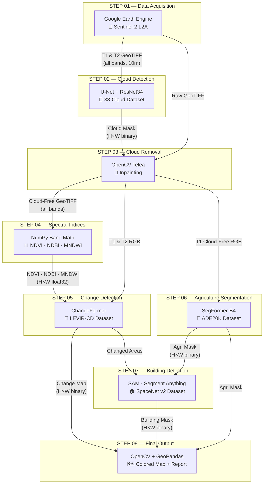

# 🛡️ Food Security AI System — Full Project Documentation

## End-to-End System for Detecting Buildings on Agricultural Land

**Team**: Data & AI Team  
**Prepared By**: Khaled Ramadan Ali  
**Duration**: 3 Months (March – May 2026)  
**Framework**: PyTorch + HuggingFace Transformers  

---

## 1. Project Overview

This system uses satellite imagery and deep learning to automatically detect illegal construction on agricultural land. The pipeline processes multi-temporal satellite images through 8 sequential steps — from raw data acquisition to a final colored map showing:

- 🔴 **RED** — Buildings detected on farmland (encroachment)
- 🟡 **YELLOW** — Vegetation that changed but no building found
- 🟢 **GREEN** — Stable agricultural areas (safe)

---

## 2. The One Dataset Per Step

Each step uses **one primary dataset/source**. This is the definitive list:

| Step | Name | Dataset / Source | Download Link |
|------|------|------------------|---------------|
| 01 | Data Acquisition | **Sentinel-2 L2A** via Google Earth Engine | [GEE Sentinel-2 Collection](https://developers.google.com/earth-engine/datasets/catalog/COPERNICUS_S2_SR_HARMONIZED) |
| 02 | Cloud Detection | **38-Cloud** (Landsat cloud masks) | [GitHub — 38-Cloud Dataset](https://github.com/SorourMo/38-Cloud-A-Cloud-Segmentation-Dataset) |
| 03 | Cloud Removal | *No dataset needed* — uses Step 02 output | — |
| 04 | Spectral Indices | *No dataset needed* — pure math on Step 03 output | — |
| 05 | Change Detection | **LEVIR-CD** (building change detection pairs) | [LEVIR-CD Download Page](https://justchenhao.github.io/LEVIR/) |
| 06 | Agriculture Segmentation | **ADE20K** (150 semantic classes) | [HuggingFace SegFormer](https://huggingface.co/nvidia/segformer-b4-finetuned-ade-512-512) |
| 07 | Building Detection | **SpaceNet v2** (building footprints from satellite) | [SpaceNet Buildings v2](https://spacenet.ai/spacenet-buildings-dataset-v2/) |
| 08 | Final Output | *No dataset needed* — combines all previous masks | — |

> **Note**: Steps 03, 04, and 08 are computational steps — they process outputs from earlier steps and require no external data.

---

## 3. The One Model Per Step

| Step | Model | Why This Model | Pretrained On | How to Load |
|------|-------|----------------|---------------|-------------|
| 01 | **Google Earth Engine API** | Free platform to download satellite imagery | — | `pip install earthengine-api` |
| 02 | **U-Net + ResNet34** | Skip connections preserve sharp cloud edges | ImageNet | `smp.Unet(encoder_weights='imagenet')` — auto-downloads |
| 03 | **OpenCV Telea Inpainting** | Fast, no GPU, works for clouds < 40% coverage | — (classical) | `cv2.inpaint()` — no weights needed |
| 04 | **NumPy Band Math** | Simple formulas: NDVI, NDBI, MNDWI | — (no model) | Pure arithmetic on pixel arrays |
| 05 | **ChangeFormer** | Siamese Transformer captures long-range changes | LEVIR-CD | Manual download from [GitHub](https://github.com/wgcban/ChangeFormer) |
| 06 | **SegFormer-B4** | HuggingFace one-liner, 150 land-cover classes | ADE20K | `from_pretrained('nvidia/segformer-b4-...')` — auto-downloads |
| 07 | **SAM (Segment Anything)** | Zero-shot segmentation, no training required | SA-1B (1.1B masks) | Download [ViT-B weights](https://dl.fbaipublicfiles.com/segment_anything/sam_vit_b_01ec64.pth) (375 MB) |
| 08 | **OpenCV + GeoPandas** | Color overlay and polygon export | — (no model) | `cv2.addWeighted()` + `gpd.GeoDataFrame()` |

---

## 4. Complete Pipeline Flow

### 4.1 End-to-End Data Flow Diagram



### 4.2 Step-by-Step Detail

---

#### STEP 01 — Data Acquisition `[Weeks 1–2]`

| | Detail |
|---|--------|
| **Goal** | Download satellite imagery for two time periods (T1=before, T2=after) |
| **Dataset** | Sentinel-2 L2A via [Google Earth Engine](https://developers.google.com/earth-engine/datasets/catalog/COPERNICUS_S2_SR_HARMONIZED) |
| **Input** | AOI polygon (lat/lon), date range, cloud cover threshold (< 20%) |
| **Output** | GeoTIFF files — T1 and T2, bands [B2, B3, B4, B8, B11], 10m resolution |
| **Code** | `src/step_01_data_acquisition/acquire.py` |

**How it works:**
1. Authenticate with GEE (`ee.Authenticate()`)
2. Define Area of Interest (rectangle from lat/lon coordinates)
3. Query `COPERNICUS/S2_SR_HARMONIZED` collection with date and cloud filters
4. Create median composite, select bands, export as GeoTIFF to Google Drive
5. Download from Drive to `data/raw/T1/` and `data/raw/T2/`

---

#### STEP 02 — Cloud Detection `[Weeks 2–3]`

| | Detail |
|---|--------|
| **Goal** | Identify which pixels are clouds in the satellite images |
| **Model** | U-Net + ResNet34 encoder ([segmentation-models-pytorch](https://github.com/qubvel/segmentation_models.pytorch)) |
| **Dataset** | [38-Cloud](https://github.com/SorourMo/38-Cloud-A-Cloud-Segmentation-Dataset) — 8,400 Landsat patches with cloud masks |
| **Input** | RGB tile tensor: (1, 3, 512, 512), float32, normalized with ImageNet mean/std |
| **Output** | Cloud probability map (H, W) float32 [0–1] + binary mask (H, W) uint8 |
| **Code** | `src/step_02_cloud_detection/detect_clouds.py` |

**How it works:**
1. Tile the GeoTIFF into 512×512 pixel patches
2. Normalize each tile with ImageNet mean/std
3. Run U-Net inference → sigmoid → probability map
4. Threshold at 0.45 → binary cloud mask
5. Stitch tiles back to full-image mask

---

#### STEP 03 — Cloud Removal `[Weeks 3–4]`

| | Detail |
|---|--------|
| **Goal** | Reconstruct the surface underneath detected clouds |
| **Model** | OpenCV Telea Inpainting ([OpenCV docs](https://docs.opencv.org/4.x/df/d3d/tutorial_py_inpainting.html)) |
| **Dataset** | None — uses cloud mask from Step 02 |
| **Input** | GeoTIFF (all bands) + binary cloud mask (H, W) uint8 |
| **Output** | Cloud-free GeoTIFF — all bands reconstructed |
| **Code** | `src/step_03_cloud_removal/remove_clouds.py` |

**How it works:**
1. For each band in the GeoTIFF:
   - Normalize to uint8
   - Apply `cv2.inpaint()` with Telea algorithm (radius=7)
2. Stack all cleaned bands back into a multi-band GeoTIFF
3. Preserve original CRS and geotransform metadata

---

#### STEP 04 — Spectral Indices `[Week 5]`

| | Detail |
|---|--------|
| **Goal** | Compute vegetation and built-up indices that highlight land types |
| **Model** | Pure NumPy — no neural network |
| **Dataset** | None — pure math on cloud-free GeoTIFFs |
| **Input** | Cloud-free T1 and T2 GeoTIFFs with NIR (B8), Red (B4), SWIR (B11), Green (B3) |
| **Output** | NDVI (H, W) float32 [-1, 1] · NDBI (H, W) · MNDWI (H, W) |
| **Code** | `src/step_04_spectral_indices/compute_indices.py` |

**Formulas:**
- **NDVI** = (NIR − Red) / (NIR + Red) → high for healthy crops
- **NDBI** = (SWIR − NIR) / (SWIR + NIR) → high for concrete/rooftops
- **MNDWI** = (Green − SWIR) / (Green + SWIR) → high for water bodies

---

#### STEP 05 — Change Detection `[Weeks 6–8]`

| | Detail |
|---|--------|
| **Goal** | Identify which pixels changed between T1 and T2 |
| **Model** | ChangeFormer — Siamese Transformer ([GitHub](https://github.com/wgcban/ChangeFormer)) |
| **Dataset** | [LEVIR-CD](https://justchenhao.github.io/LEVIR/) — 637 pairs of 1024×1024 with building change labels |
| **Input** | T1 tensor (1, 3, 256, 256) + T2 tensor (1, 3, 256, 256), float32, ImageNet normalized |
| **Output** | Binary change map (H, W) — 255=changed, 0=unchanged |
| **Code** | `src/step_05_change_detection/detect_changes.py` |

**How it works:**
1. Tile both T1 and T2 into co-registered 256×256 patches
2. Feed each pair through the Siamese Transformer encoder
3. Difference module at decoder detects changed regions
4. `argmax` on output logits → binary change map
5. Stitch tiles back to full resolution

---

#### STEP 06 — Agriculture Segmentation `[Weeks 8–9]`

| | Detail |
|---|--------|
| **Goal** | Identify which pixels were agricultural land in T1 |
| **Model** | SegFormer-B4 ([HuggingFace](https://huggingface.co/nvidia/segformer-b4-finetuned-ade-512-512)) |
| **Dataset** | [ADE20K](https://groups.csail.mit.edu/vision/datasets/ADE20K/) — 150 semantic classes (auto-downloaded via HuggingFace) |
| **Input** | T1 cloud-free RGB image (H, W, 3) uint8 |
| **Output** | Agriculture mask (H, W) uint8 — 255=farmland, 0=other |
| **Code** | `src/step_06_agriculture_segmentation/segment_agriculture.py` |

**How it works:**
1. Load image, preprocess with `SegformerImageProcessor`
2. Run inference → logits (1, 150, H/4, W/4)
3. Upsample to original size with bilinear interpolation
4. `argmax` → semantic label map (150 classes)
5. Filter agriculture-related ADE20K class IDs: `field=9, earth=29, grass=92, dirt=94, plant=96`
6. Create binary agriculture mask

---

#### STEP 07 — Building Detection `[Weeks 9–11]`

| | Detail |
|---|--------|
| **Goal** | Find buildings in the areas that are both *changed* AND *agricultural* |
| **Model** | SAM — Segment Anything Model ([GitHub](https://github.com/facebookresearch/segment-anything)) |
| **Dataset** | [SpaceNet v2](https://spacenet.ai/spacenet-buildings-dataset-v2/) — building polygons from satellite imagery |
| **Input** | T2 RGB image cropped to (changed ∩ agricultural) overlap area |
| **Output** | Building mask (H, W) uint8 + instance polygons + confidence scores |
| **Code** | `src/step_07_building_detection/detect_buildings.py` |

**How it works:**
1. Compute overlap region: `changed_pixels AND agricultural_pixels`
2. Crop T2 RGB to this overlap region
3. Run SAM `SamAutomaticMaskGenerator` → list of segment masks
4. Filter segments by area (>100 px), IoU threshold, and stability score
5. Merge building masks → final combined building footprint mask

---

#### STEP 08 — Final Output `[Weeks 11–12]`

| | Detail |
|---|--------|
| **Goal** | Combine all masks into one colored visualization + reports |
| **Model** | OpenCV + NumPy + GeoPandas (no ML model) |
| **Dataset** | None — combines outputs from Steps 05, 06, 07 |
| **Input** | change_map + agri_mask + building_mask + T2 RGB image |
| **Output** | `final_colored.png`, `final_colored.tif`, `encroachment.geojson`, `report.json` |
| **Code** | `src/step_08_final_output/generate_output.py` |

**Color Logic:**
1. 🔴 **RED** = `building_mask > 0 AND agri_mask > 0 AND change_map > 0` → buildings on farmland
2. 🟡 **YELLOW** = `change_map > 0 AND agri_mask > 0 AND NOT red_region` → changed vegetation
3. 🟢 **GREEN** = `agri_mask > 0 AND change_map == 0` → stable agriculture

---

## 5. Technology Stack

| Category | Tool | Purpose |
|----------|------|---------|
| Data Access | Google Earth Engine, rasterio, GDAL | Download and read satellite imagery |
| Cloud Detection | segmentation-models-pytorch, PyTorch | U-Net + ResNet34 cloud masking |
| Cloud Removal | OpenCV, NumPy | Telea inpainting algorithm |
| Preprocessing | rasterio, NumPy | Band math — NDVI, NDBI, MNDWI |
| Change Detection | ChangeFormer, PyTorch | Siamese Transformer for changed pixels |
| Segmentation | HuggingFace Transformers, SegFormer-B4 | Identify agricultural land |
| Building Detection | SAM (Meta AI) | Zero-shot building segmentation |
| Visualization | GeoPandas, Folium, Matplotlib | Color maps, GeoJSON polygons, reports |

---

## 6. Project Timeline

```
MARCH 2026                APRIL 2026                  MAY 2026
W1    W2    W3    W4      W5    W6    W7    W8        W9    W10   W11   W12
├─────┼─────┤                                          ← Step 01: Data Acquisition
      ├─────┼─────┤                                    ← Step 02: Cloud Detection
            ├─────┼─────┤                              ← Step 03: Cloud Removal
                        ├─────┤                        ← Step 04: Spectral Indices
                              ├─────┼─────┼─────┤     ← Step 05: Change Detection
                                          ├─────┼─────┤← Step 06: Agri Segmentation
                                                ├─────┼─────┼─────┤ ← Step 07: Building Detection
                                                            ├─────┼─────┤ ← Step 08: Final Output
```

---

## 7. File Structure

```
Graduation_project_AI_system/
├── config/
│   └── settings.py                          # Centralized configuration
├── src/
│   ├── __init__.py
│   ├── utils/
│   │   ├── geo_utils.py                     # GeoTIFF I/O, CRS handling
│   │   ├── tile_utils.py                    # Image tiling & stitching
│   │   └── logger.py                        # Pipeline logging
│   ├── step_01_data_acquisition/acquire.py  # GEE download
│   ├── step_02_cloud_detection/detect_clouds.py     # U-Net
│   ├── step_03_cloud_removal/remove_clouds.py       # OpenCV Telea
│   ├── step_04_spectral_indices/compute_indices.py  # NumPy
│   ├── step_05_change_detection/detect_changes.py   # ChangeFormer
│   ├── step_06_agriculture_segmentation/segment_agriculture.py  # SegFormer
│   ├── step_07_building_detection/detect_buildings.py  # SAM
│   └── step_08_final_output/generate_output.py      # Color map
├── pipeline.py                              # End-to-end orchestrator
├── run.py                                   # CLI entry point
├── requirements.txt                         # Dependencies
├── PROJECT_DETAILS.md                       # ← This file
└── PRESENTATION_OUTLINE.md                  # Slide-by-slide outline
```
