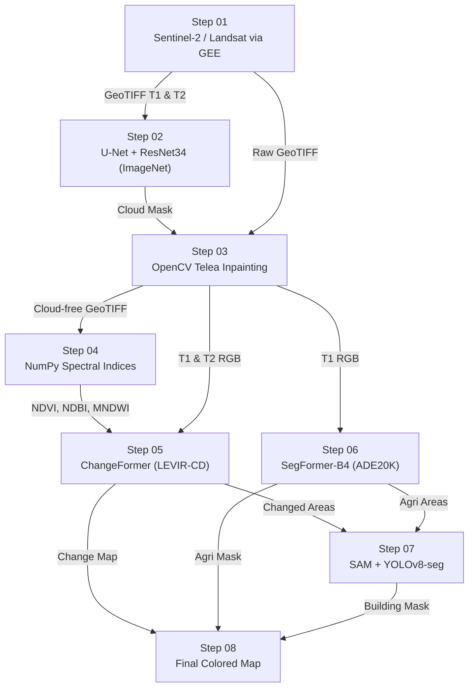

# 📦 Datasets & Pretrained Weights — Per-Step Reference

Complete reference of every dataset, pretrained model, and external data source used across the 8-step pipeline.

---

## Step 01 — Data Acquisition

| Resource | Link | Used For |
|----------|------|----------|
| **Sentinel-2 L2A** | [Copernicus Open Access Hub](https://scihub.copernicus.eu/) / [GEE collection](https://developers.google.com/earth-engine/datasets/catalog/COPERNICUS_S2_SR_HARMONIZED) | Primary satellite imagery — 10m resolution, 13 bands, global coverage |
| **Landsat-8/9** | [USGS EarthExplorer](https://earthexplorer.usgs.gov/) / [GEE collection](https://developers.google.com/earth-engine/datasets/catalog/LANDSAT_LC09_C02_T1_L2) | Backup satellite imagery — 30m resolution |
| **Google Earth Engine** | [GEE Platform](https://earthengine.google.com/) / [Python API](https://developers.google.com/earth-engine/guides/python_install) | Cloud platform to query & export imagery (not a dataset itself) |

> [!NOTE]
> GEE is the **data platform**, not a dataset. It hosts both Sentinel-2 and Landsat collections. You write a script → GEE exports GeoTIFFs to Google Drive.

---

## Step 02 — Cloud Detection

| Resource | Link | Used For |
|----------|------|----------|
| **U-Net + ResNet34 (ImageNet pretrained)** | [segmentation-models-pytorch](https://github.com/qubvel/segmentation_models.pytorch) | Encoder weights — auto-downloaded via `encoder_weights='imagenet'` |
| **38-Cloud Dataset** | [GitHub — SorourMo/38-Cloud](https://github.com/SorourMo/38-Cloud-A-Cloud-Segmentation-Dataset) | 8,400 Landsat patches with cloud/clear masks (for fine-tuning or validation) |
| **CloudSEN12** | [Zenodo — CloudSEN12](https://zenodo.org/record/7431205) | 50K+ Sentinel-2 patches with expert cloud annotations (alternative training data) |

> [!TIP]
> For zero-shot inference, only the **ImageNet pretrained weights** (auto-downloaded) are needed. Use 38-Cloud or CloudSEN12 only if you need to **fine-tune** or **evaluate** the cloud detector.

---

## Step 03 — Cloud Removal (Inpainting)

| Resource | Link | Used For |
|----------|------|----------|
| **OpenCV Telea Inpainting** | [OpenCV Docs](https://docs.opencv.org/4.x/df/d3d/tutorial_py_inpainting.html) | Classical algorithm — no dataset needed, operates on Step 02 output |
| **DSen2-CR** *(optional)* | [GitHub — ameraner/dsen2-cr](https://github.com/ameraner/dsen2-cr) | Deep learning cloud removal model (for large cloud regions) |
| **SEN12MS-CR Dataset** *(optional)* | [MediaTUM — SEN12MS-CR](https://mediatum.ub.tum.de/1554803) | SAR + optical pairs for training/evaluating DSen2-CR |

> [!NOTE]
> This step uses **no external dataset** by default. It consumes the cloud mask from Step 02 and applies inpainting to the raw GeoTIFFs from Step 01. DSen2-CR and its dataset are optional upgrades.

---

## Step 04 — Spectral Indices

| Resource | Link | Used For |
|----------|------|----------|
| **No external dataset** | — | Pure NumPy math on the cloud-free GeoTIFFs from Step 03 |
| **Sentinel-2 Band Reference** | [Sentinel Hub Docs](https://docs.sentinel-hub.com/api/latest/data/sentinel-2-l2a/bands/) | Band definitions (B4=Red, B8=NIR, B11=SWIR, B3=Green) |

> [!NOTE]
> This step is purely computational: NDVI = (NIR−Red)/(NIR+Red), NDBI = (SWIR−NIR)/(SWIR+NIR), MNDWI = (Green−SWIR)/(Green+SWIR). No model or dataset needed.

---

## Step 05 — Change Detection

| Resource | Link | Used For |
|----------|------|----------|
| **ChangeFormer (pretrained LEVIR-CD)** | [GitHub — wgcban/ChangeFormer](https://github.com/wgcban/ChangeFormer) | Siamese Transformer model — pretrained weights on LEVIR-CD |
| **LEVIR-CD Dataset** | [LEVIR-CD Homepage](https://justchenhao.github.io/LEVIR/) | 637 pairs of 1024×1024 images with building change labels (primary training/eval data) |
| **WHU Building Change Detection** | [WHU Download Page](https://study.rsgis.whu.edu.cn/pages/download/building_dataset.html) | Before/after aerial image pairs — Christchurch NZ earthquake changes |
| **ChangeFormer Paper** | [arXiv:2201.01293](https://arxiv.org/abs/2201.01293) | Technical reference for the model architecture |

> [!IMPORTANT]
> **LEVIR-CD** is the most critical dataset for this project. It provides pre-registered T1/T2 pairs that can also be used to test Steps 02–08 without needing GEE access.

---

## Step 06 — Agriculture Segmentation

| Resource | Link | Used For |
|----------|------|----------|
| **SegFormer-B4 (ADE20K pretrained)** | [HuggingFace Model Card](https://huggingface.co/nvidia/segformer-b4-finetuned-ade-512-512) | Semantic segmentation model — weights auto-downloaded via `from_pretrained()` |
| **ADE20K Dataset** | [MIT ADE20K](https://groups.csail.mit.edu/vision/datasets/ADE20K/) | 150 semantic classes (field, earth, grass, farm) — already baked into pretrained weights |
| **ESRI Land Cover 2023** | [ArcGIS Living Atlas](https://livingatlas.arcgis.com/landcover/) | 10m global land cover (for **validation** / cross-checking agriculture masks) |
| **Dynamic World (GEE)** | [GEE Dynamic World](https://developers.google.com/earth-engine/datasets/catalog/GOOGLE_DYNAMICWORLD_V1) | Near-real-time land cover from GEE (alternative validation source) |

> [!TIP]
> For inference, only the **HuggingFace model** is needed (auto-downloads). ADE20K classes used: `field=9`, `earth=29`, `grass=92`, `dirt=94`, `plant=96`.

---

## Step 07 — Building Detection

| Resource | Link | Used For |
|----------|------|----------|
| **SAM (Segment Anything Model)** | [GitHub — facebookresearch/segment-anything](https://github.com/facebookresearch/segment-anything) | Zero-shot segmentation — `vit_b` (375MB) or `vit_h` (2.5GB) weights |
| **SAM ViT-B Weights** | [Direct Download](https://dl.fbaipublicfiles.com/segment_anything/sam_vit_b_01ec64.pth) | Lightweight SAM checkpoint (375MB) |
| **SAM ViT-H Weights** | [Direct Download](https://dl.fbaipublicfiles.com/segment_anything/sam_vit_h_4b8939.pth) | Best accuracy SAM checkpoint (2.5GB) |
| **YOLOv8-seg (COCO pretrained)** | [Ultralytics Docs](https://docs.ultralytics.com/) / [GitHub](https://github.com/ultralytics/ultralytics) | Instance segmentation — weights auto-downloaded via `YOLO('yolov8m-seg.pt')` |
| **SpaceNet v2** | [SpaceNet Buildings v2](https://spacenet.ai/spacenet-buildings-dataset-v2/) | Building polygons from satellite imagery (for fine-tuning YOLOv8 on satellite domain) |
| **WHU Building Dataset** | [WHU Download](https://study.rsgis.whu.edu.cn/pages/download/building_dataset.html) | 220K+ building instances (alternative fine-tuning data) |
| **Microsoft Building Footprints** | [GitHub — microsoft/GlobalMLBuildingFootprints](https://github.com/microsoft/GlobalMLBuildingFootprints) | ML-derived building polygons for 190+ countries (validation / supplementary data) |
| **SAM Paper** | [arXiv:2304.02643](https://arxiv.org/abs/2304.02643) | Technical reference |

---

## Step 08 — Final Output & Visualization

| Resource | Link | Used For |
|----------|------|----------|
| **No external dataset** | — | Combines masks from Steps 05, 06, 07 with T2 RGB image |
| **GeoPandas** | [geopandas.org](https://geopandas.org/) | Convert pixel masks → vector polygons (GeoJSON/Shapefile) |
| **Folium** | [Folium Docs](https://python-visualization.github.io/folium/) | Interactive web map visualization |

> [!NOTE]
> This step is pure post-processing — no external training data. Outputs: colored PNG, GeoTIFF, GeoJSON polygons, and JSON report.

---

## Summary: Data Flow Across Steps

## Quick-Start: Minimum Required Downloads

If you want to run the full pipeline with **minimum manual downloads**, here's what you need:

| What | Size | How |
|------|------|-----|
| GEE Python API | ~5 MB | `pip install earthengine-api` |
| U-Net ResNet34 | ~100 MB | Auto-downloaded by `smp` library |
| ChangeFormer LEVIR-CD weights | ~200 MB | Manual download from [GitHub releases](https://github.com/wgcban/ChangeFormer) |
| SegFormer-B4 ADE20K | ~200 MB | Auto-downloaded by HuggingFace |
| SAM ViT-B | ~375 MB | [Direct download](https://dl.fbaipublicfiles.com/segment_anything/sam_vit_b_01ec64.pth) |
| YOLOv8m-seg COCO | ~50 MB | Auto-downloaded by Ultralytics |
| **LEVIR-CD Dataset** *(for testing)* | ~3 GB | [Download page](https://justchenhao.github.io/LEVIR/) |
